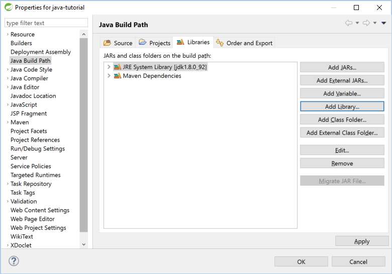
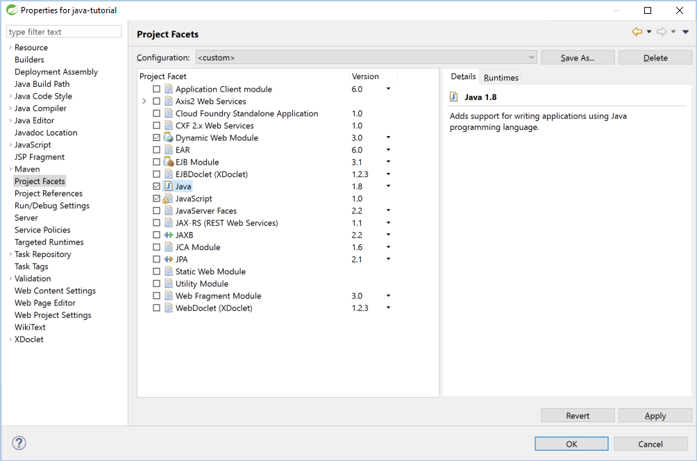

## Before you begin

You need to install the [Java SE Development Kit (JDK)](http://www.oracle.com/technetwork/java/javase/downloads/index-jsp-138363.html#javasejdk). This guide was written with JDK 8 Update 92.

If you want to follow along exactly, download [Spring Tool Suite](http://spring.io/tools/sts). This guide was written with version 3.7.3.RELEASE. You can use any IDE you want, but you might have to do some steps differently.

> **NOTE**: If must install the version of Spring Tool Suite (either 64-bit or 32-bit) that corresponds to the version of the JDK you installed. For example, if you install the 64-bit JDK, install the 64-bit version of Spring Tool Suite.

### Spring Tool Suite setup

If this is your first time using Spring Tool Suite, you should complete the following steps to configure it to work with your downloaded JDK, and to make adding dependencies with Maven easier.

1. Launch Spring Tool Suite. On the **Window** menu, choose **Preferences**.

1. Expand **Java** and select **Installed JREs**. Click **Add**.

1. Choose **Standard VM** and click **Next**.

1. Click the **Directory** button next to **JRE home**. Browse to the directory where you installed the JDK. Click **Finish**.

  
1. In the list of **Installed JREs**, make sure that the entry you just added is checked, making it the default. Click **OK**.

1. On the **Window** menu, choose **Show View**, then **Other**. Choose **Maven Repositories** from the list of views and click **OK**.

1. In the **Maven Repositories** window, expand **Global Repositories**. Right-click the **central** item there and choose **Rebuild Index**. This takes a few minutes, so let it complete before continuing.

## Create the app ##

In Spring Tool Suite, on the **File** menu, choose **New**, then **Other**. In the list of wizards, expand **Maven**, then choose **Maven Project**. Click **Next**.

Check the **Create a simple project (skip archetype selection)** checkbox and click **Next**.

Enter a value for **Group Id** (for example, based on your website domain). Enter `java-tutorial` for **Artifact Id**. Change **Packaging** to `war`. Click **Finish**.


In **Project Explorer**, right-click the project and choose **Properties**. Select **Java Build Path**, then select the **Libraries** tab. If the version of the **JRE System Library** does not match the version of the JDK you installed, do the following:

1. Select the **JRE System Library** and click **Remove**. 

1. Click **Add Library**. Choose **JRE System Library** and click **Next**.

1. Select **Workspace default JRE** and click **Finish**.

  
  
1. Click **OK**.

Right-click the project and choose **Properties**. Select **Project Facets**. Change the version of **Dynamic Web Module** to `3.0`. Change the version of **Java** to `1.8`.



Click **OK**. In order to force Spring Tool Suite to recognize the facet changes, we need to close and reopen the project. Right-click the project and choose **Close Project**. Then double-click (or right-click and choose **Open Project**) to reopen the project.

In **Project Explorer** right-click the **Deployment Descriptor: java-tutorial** item and choose **Generate Deployment Descriptor Stub**.

Now let's configure the project to build with Maven and run on a local test server. To do this, let's add some plugins in `pom.xml`. Open `pom.xml`, then click the **pom.xml** tab at the bottom of the window to view the raw XML. Add the following code immediately after the `<packaging>war</packaging>` line:

```xml
<build>
  <plugins>
    <plugin>
      <groupId>org.eclipse.jetty</groupId>
      <artifactId>jetty-maven-plugin</artifactId>
      <version>9.3.8.v20160314</version>
    </plugin>
    <plugin>
      <groupId>org.apache.maven.plugins</groupId>
      <artifactId>maven-compiler-plugin</artifactId>
      <version>3.5.1</version>
      <configuration>
        <source>1.8</source>
        <target>1.8</target>
      </configuration>
    </plugin>
  </plugins>
</build>
```

This code adds the [Jetty server maven plugin](http://www.eclipse.org/jetty/documentation/current/jetty-maven-plugin.html), which runs your project on an embedded Jetty web server at http://localhost:8080. It also adds the Maven compiler plugin.

Save the file. Right-click the project in **Project Explorer** and choose **Maven**, then **Update Project**. Click **OK**.

Now let's make sure it works. Right-click the project and choose **Run as**, then **Maven build**. In the **Goals** field, enter `jetty:run`, then click **Run**. In the **Console** view, you should see output from the Maven build process. Assuming nothing goes wrong, you should eventually see `[INFO] Started Jetty Server`. Open a browser and browse to http://localhost:8080. Because there is no content there, you should see something like this:


Now that we have the environment ready, we're ready to start coding!